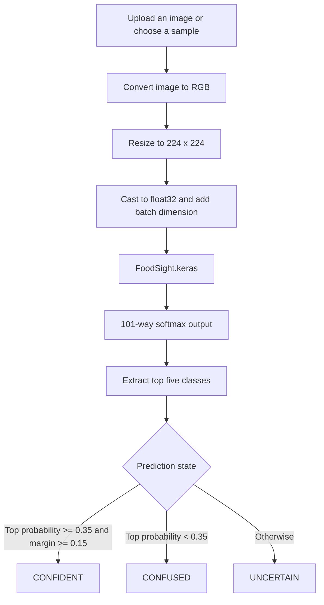

# FoodSight

FoodSight is an image-classification app that answers a simple question: **what dish is in this image?** Upload a food photograph, choose one of the bundled examples, and FoodSight uses a fine-tuned EfficientNet-B0 model to rank the image against the 101 categories in the [Food-101 dataset](https://data.vision.ee.ethz.ch/cvl/datasets_extra/food-101/).

The app is built with Streamlit and TensorFlow. It is designed to make the prediction process inspectable rather than presenting a single unexplained label: the interface shows the resized image supplied to the model, the leading prediction, a confidence state, and a top-five probability breakdown.

## Features

- Classifies images into 101 Food-101 dish categories.
- Accepts PNG, JPG, and JPEG uploads.
- Includes one local sample image for every supported class.
- Provides quick sample buttons for popular dishes such as pizza, sushi, ramen, and tacos.
- Resizes every input to the model's required 224 x 224 RGB tensor.
- Displays the model's top prediction and top-five outputs.
- Labels results as `CONFIDENT`, `UNCERTAIN`, or `CONFUSED` using the prediction probability and the gap between the first two predictions.
- Shows the resized model input beside the original image.
- Uses Streamlit resource and data caching so the model and class list are not reloaded unnecessarily.
- Protects inference with a lock, which keeps model access serialized if multiple Streamlit interactions reach prediction at once.

## Live Workflow

The prediction flow is:



### 1. Choose an image

There are two ways to provide an image:

- Upload a PNG, JPG, or JPEG through the file uploader.
- Select a dish from the searchable list or popular sample pills, then load its bundled sample image.

The repository contains 101 sample JPGs under `assets/samples/`, matching the 101 lines in `utils/class_names.txt`.

### 2. Prepare the image

Before inference, `utils.utilities.preprocess_image()`:

1. Converts non-RGB images, including grayscale images and images with transparency, to RGB.
2. Converts the PIL image into a TensorFlow tensor.
3. Resizes it to 224 x 224 pixels.
4. Casts the pixel values to `float32`.
5. Adds a batch dimension, producing a tensor with shape `(1, 224, 224, 3)`.

The app displays a visual 224 x 224 preview so it is clear what spatial representation reaches the classifier. The preview is a resized image representation; the actual tensor is the float32 tensor returned by the preprocessing function.

### 3. Generate predictions

`model/FoodSight.keras` returns 101 values, one for each class in `utils/class_names.txt`. The class index is important: the output at index `i` is interpreted using the class name at line `i` in that file.

The app selects the five largest values with TensorFlow's `tf.math.top_k`. The table exposes both:

- **Confidence %**: the same value formatted as a percentage with two decimal places.
- **Confidence Score**: the underlying probability-like value in the interval from 0 to 1.

## Understanding the Confidence State

FoodSight does not treat every top prediction as equally persuasive. After extracting the top results, it calculates:

```text
margin = probability of first prediction - probability of second prediction
```

The current rules are:

| State | Rule | Meaning |
|---|---|---|
| `CONFIDENT` | Top probability is at least `0.35` and the margin is at least `0.15` | One class is sufficiently strong and clearly ahead of the runner-up. |
| `CONFUSED` | Top probability is below `0.35` | No class has a strong enough score to support a clear result. |
| `UNCERTAIN` | Any other case | The leading class may be plausible, but the runner-up is close enough to show both. |

These are application display rules, not a guarantee that the model is correct. The model was trained to choose among a fixed set of 101 dishes. An image of an unsupported dish, a poorly framed image, or a visually ambiguous dish will still receive a best guess because the classifier has no explicit `unknown food` output.

## Why Can Softmax Show `1.0` and Tiny Other Values?

The saved model's final layer is a TensorFlow softmax activation. In exact mathematics, softmax is:

$$
\operatorname{softmax}(z_i) = \frac{e^{z_i}}{\sum_{j=1}^{101} e^{z_j}}
$$

where `z` is the vector of raw model scores, or logits. The ideal probabilities are non-negative and sum to one.

For a very confident prediction, the winning logit can be much larger than the others. After the usual numerically stable subtraction of the largest logit, the winning term is approximately `1` and the remaining exponential terms can be extremely small, for example `10^-4` or `10^-5`.

The model runs with finite-precision floating-point arithmetic rather than exact real numbers. When the denominator is accumulated, contributions that are small compared with the precision of the current value can be rounded away. The winning output can therefore be stored as exactly `1.0`, while the losing outputs remain representable as small positive numbers. Adding the stored values may then produce a result slightly greater than one.

That observation does **not** mean the model has produced a mathematically valid probability distribution with a total greater than one. It means the computed float32 values contain a small numerical normalization error. It is especially visible for overconfident predictions because the gap between the winning logit and the other logits is large.

There are two additional display details worth keeping in mind:

- The interface shows only the top five of 101 outputs. Their displayed values are not expected to add up to 100% because the other 96 classes are omitted.
- Percentages are rounded to two decimal places, so the displayed table can differ slightly from the underlying values used by the progress bars and state logic.

### How to investigate it

The current app exposes the raw top-five scores in the **Raw Model Outputs** popover. For a deeper diagnosis, inspect the complete model output before selecting the top five and compare:

```python
outputs = model.predict(processed_image, verbose=0)[0]
print(outputs.dtype)
print(outputs.sum())
print(outputs.max())
```

The saved model has a softmax output, so the sum should be very close to `1.0`; a tiny deviation is expected from floating-point computation. To inspect the logits themselves, the model would need to expose or reconstruct the layer immediately before the final softmax. The current inference app does not return logits.

### Can it be prevented?

This numerical effect can be reduced by renormalizing a copied output vector before displaying it:

```python
probabilities = outputs / outputs.sum()
```

Renormalization changes only the reported values, not the model's ranking or its learned behavior. It should not be confused with solving overconfidence. If confidence calibration is a goal for a future training iteration, possible approaches include label smoothing, temperature scaling on a validation set, or training with a broader set of out-of-domain images. Those changes require a training and evaluation workflow; they are not part of this inference-only repository.

## Model and Dataset

FoodSight is intended for the 101 categories from Food-101, including:

`apple_pie`, `baklava`, `bibimbap`, `cannoli`, `chicken_curry`, `chocolate_cake`, `french_fries`, `hamburger`, `ice_cream`, `lasagna`, `pizza`, `ramen`, `sushi`, `tacos`, `tiramisu`, `waffles`, and many others.

The complete class order is stored in [`utils/class_names.txt`](utils/class_names.txt). It must remain aligned with the model's output indices. Renaming, reordering, or deleting entries will make otherwise valid predictions display the wrong dish name.

The model file is [`model/FoodSight.keras`](model/FoodSight.keras). A runtime inspection of the saved artifact confirms:

| Property | Value |
|---|---|
| Input shape | `(None, 224, 224, 3)` |
| Output shape | `(None, 101)` |
| Final activation | Softmax |
| Runtime | TensorFlow / Keras |

The repository contains the trained model and inference interface, but not the training notebook or training dataset. Consequently, this README documents how the deployed model behaves and does not claim training accuracy, validation accuracy, or a particular train/test split.

## Repository Structure

```text
Food-Sight/
├── app.py                    # Streamlit user interface and inference flow
├── model/
│   └── FoodSight.keras       # Saved TensorFlow/Keras classifier
├── utils/
│   ├── __init__.py
│   ├── class_names.txt       # 101 class names in model-output order
│   └── utilities.py          # Preprocessing, top-k extraction, state logic
├── assets/
│   ├── samples/              # One JPG sample for each supported class
│   └── silc_readme.md        # README from the earlier SILC project
├── requirements.txt          # Runtime dependencies
├── pyproject.toml            # Project metadata and dependency constraints
├── model prob reaching.txt   # Notes on softmax floating-point behavior
├── LICENSE
└── README.md
```

## Local Setup

### Requirements

- Python 3.11 or newer.
- A CPU capable of running TensorFlow inference.
- Enough disk space for the TensorFlow runtime and the saved model.

### Install

From the repository root:

```bash
python3 -m venv .venv
.venv/bin/python -m pip install --upgrade pip
.venv/bin/python -m pip install -r requirements.txt
```

The dependency set includes Streamlit, Pillow, TensorFlow CPU, and NumPy. The project metadata in `pyproject.toml` also requires Python `>=3.11`.

### Run

```bash
.venv/bin/streamlit run app.py --server.address=0.0.0.0 --server.port=8501
```

Open [http://localhost:8501](http://localhost:8501) in a browser. On first load, Streamlit loads and caches the Keras model. CPU-only inference can take a little longer on the first prediction while TensorFlow initializes.

## API and Inference Notes

FoodSight is currently a Streamlit application, not a separate REST API. Predictions are made inside the Streamlit process when the user presses **Identify This**.

The core inference call is conceptually:

```python
processed_image = utilities.preprocess_image(image)
predictions = model.predict(processed_image)
top_predictions = utilities.top_k_preds(predictions)
```

`top_k_preds()` returns five dictionaries with a `label` and a raw `confidence` value. The UI then keeps the raw value as `Probability` and converts a copy to a percentage for presentation.

## Limitations

- **Fixed label set:** The classifier can only choose among 101 Food-101 categories. It cannot reliably identify a dish outside those categories.
- **Best-guess behavior:** Softmax always distributes scores across the known classes; a high score is not proof that the image belongs to the dataset.
- **Visual ambiguity:** Dishes with similar colors, textures, or plating can be difficult to distinguish, such as chocolate cake versus chocolate mousse.
- **Framing and image quality:** Heavy cropping, poor lighting, packaging, clutter, or a dish occupying only a small part of the image can reduce performance.
- **Resize information loss:** Every image is resized to 224 x 224, so very small details may disappear or become distorted.
- **Confidence calibration:** The displayed score is the model's softmax output, not a formally calibrated probability of correctness.
- **Inference-only repository:** Training scripts, experiment logs, evaluation metrics, and dataset files are not included here.

## Good Input Practices

For the most useful result:

- Keep the dish as the main subject and place it near the center.
- Use clear, well-lit images with enough visible surface area.
- Avoid strong obstructions such as hands, wrappers, or utensils covering most of the food.
- Choose an angle that exposes the dish's characteristic shape and texture.
- Treat `CONFUSED` and `UNCERTAIN` results as prompts to inspect the top-five alternatives, not as definitive identifications.

## License

See [`LICENSE`](LICENSE) for the project's license terms.
